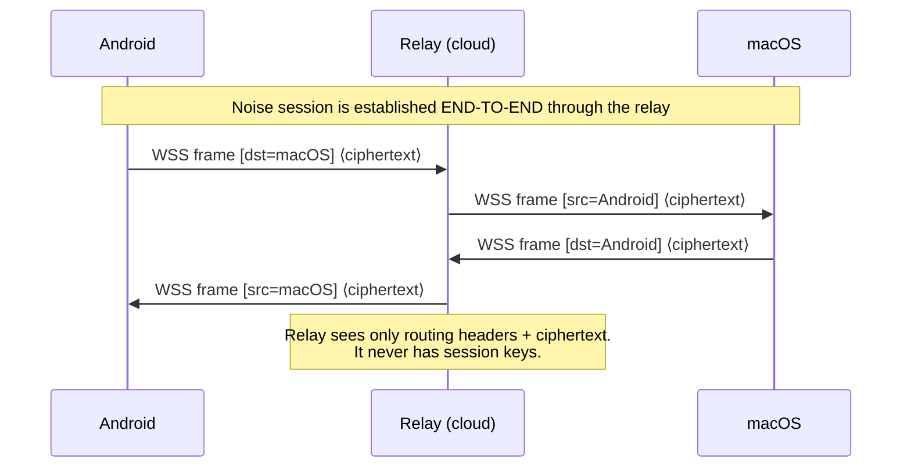
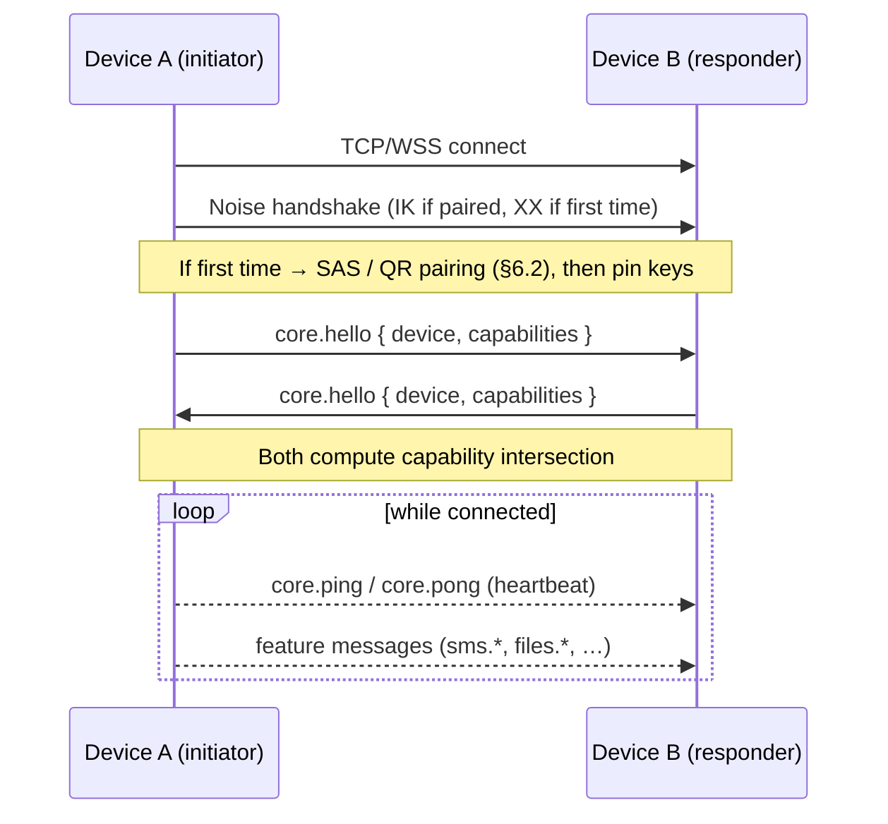
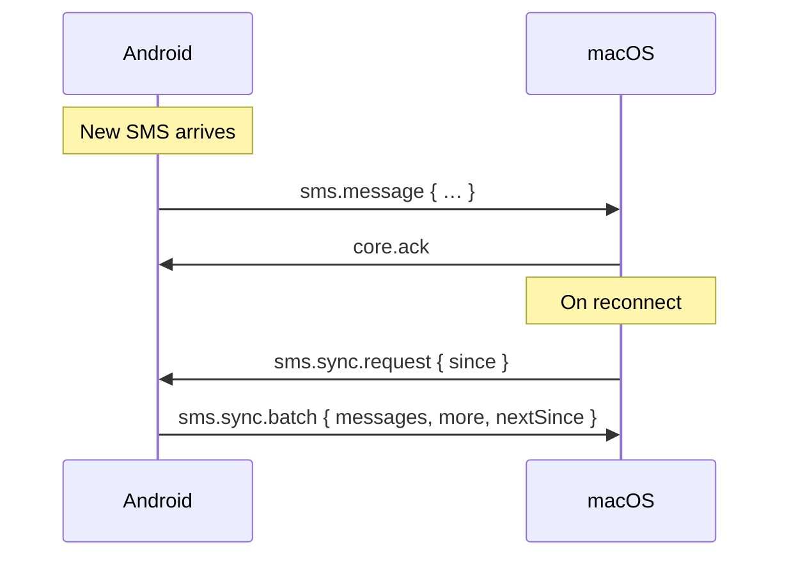
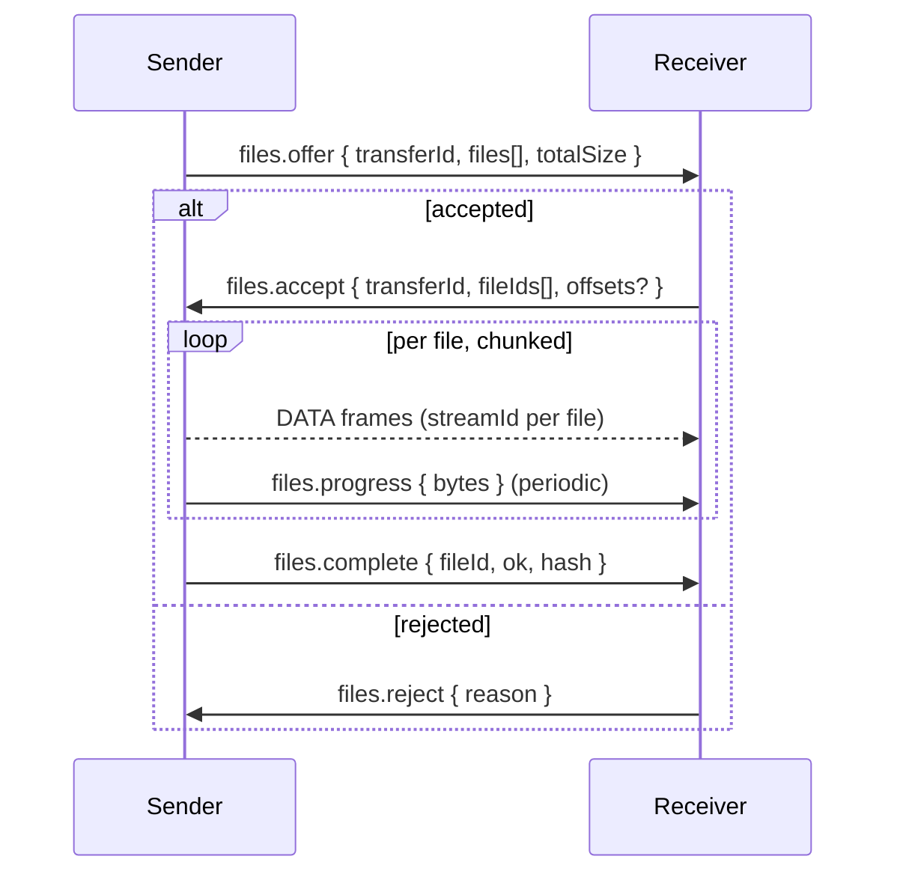

# AirNinja Protocol Specification

**Version:** 1 (draft)
**Status:** Phase 1 — design only (no implementation yet)
**Scope:** A KDE-Connect-style protocol linking personal devices (initially Android ⇄ macOS).

---

## 1. Overview & Goals

AirNinja is a peer-to-peer protocol that lets a user's own devices talk to each other
to bridge notifications, messages, files and more. Phase 1 targets three concrete features
and a foundation general enough to grow:

1. **SMS bridge** — forward SMS from Android to macOS.
2. **File share Android → macOS** (AirDrop-like).
3. **File share macOS → Android** (AirDrop-like).
4. **Universal & extensible** — new features plug in without protocol-breaking changes.

### Design goals

- **End-to-end encrypted, always.** Every payload is encrypted between the two endpoints on
  *every* transport. (See the invariant below — it is non-negotiable.)
- **Transport-agnostic.** Works on the LAN directly, and falls back to a cloud relay when
  devices are on different networks, with identical security guarantees.
- **Pluggable features.** Each capability is self-contained and negotiated, so devices with
  different versions/feature sets interoperate gracefully.
- **Reliable where it matters.** Events that must not be lost (e.g. an SMS) are acknowledged
  and can be stored-and-forwarded while a peer is offline.
- **Simple to implement.** JSON control plane, binary bulk plane, a single well-known
  cryptographic handshake.

### 🔒 Core invariant — mandatory end-to-end encryption

> All payloads (SMS, files, and every future feature) are encrypted **end-to-end between the
> two devices**. This holds on **every** transport, including the cloud relay. The relay
> only ever sees opaque ciphertext and **never** holds session keys or plaintext. No
> transport mode and no future feature may weaken this. The entire protocol is designed
> around this invariant.

### Non-goals (Phase 1)

- No third-party / multi-user sharing (devices belong to one user).
- No group/mesh sessions — connections are pairwise.
- No backwards compatibility with the KDE Connect wire protocol (we borrow ideas, not bytes).

---

## 2. Terminology

| Term | Meaning |
|------|---------|
| **Device** | A participant (phone, laptop, …) with a stable identity. |
| **Device ID** | Stable identifier derived from a device's public identity key. |
| **Peer** | The remote device in a connection. |
| **Pairing** | One-time mutual authentication that establishes trust between two devices. |
| **Capability** | A named feature a device supports (e.g. `sms.bridge`). |
| **Transport** | The byte pipe carrying frames: LAN TCP or relay WebSocket. |
| **Secure channel** | The Noise-encrypted session running over a transport. |
| **Relay** | Optional cloud server that forwards ciphertext between devices on different networks. |
| **Frame** | The smallest unit on the secure channel: a typed, length-prefixed blob. |
| **Envelope** | A JSON control message carried in a `CONTROL` frame. |
| **SAS** | Short Authentication String shown during pairing for human verification. |

---

## 3. Architecture

The protocol is layered so each concern is independent and replaceable. Features sit at the
top and never touch transport or crypto details directly.

```
┌─────────────────────────────────────────────────┐
│  Features    sms.bridge · files.transfer · …      │  capability-negotiated, namespaced
├─────────────────────────────────────────────────┤
│  Messaging   JSON envelope, request/response      │  control plane
├─────────────────────────────────────────────────┤
│  Framing     length-prefixed CONTROL/DATA frames  │  multiplexed streams
├─────────────────────────────────────────────────┤
│  Secure channel  Noise Protocol Framework         │  end-to-end, transport-agnostic
├─────────────────────────────────────────────────┤
│  Transport   LAN TCP   |   Relay WebSocket        │  interchangeable
└─────────────────────────────────────────────────┘
```

Key property: the **secure channel sits *above* the transport**, so the relay (a transport)
is below the encryption boundary and can never see plaintext.

---

## 4. Device Identity & Addressing

Each device generates a **long-term identity keypair** on first launch and stores the
private key in the platform secure store (Android Keystore / macOS Keychain).

- **Identity keypair:** Curve25519 (X25519 for the Noise handshake; the same key material
  also serves as the device's static identity). Implementations MAY additionally hold an
  Ed25519 signing key derived from the same seed for out-of-band signed advertisements.
- **Device ID:** `base32( SHA-256( static_public_key ) )`, lowercased, truncated to 52
  characters (no padding). Stable for the lifetime of the keypair.
- **Device metadata** (advertised in discovery and in `core.hello`):

```json
{
  "deviceId": "k7p3m2x9...",
  "name": "Piotr's Pixel",
  "type": "phone",
  "platform": "android",
  "protocolVersion": 1
}
```

`type` ∈ `{phone, tablet, laptop, desktop, other}`. `platform` is informational
(`android`, `macos`, `linux`, `windows`, `ios`, …).

Rotating the identity key changes the Device ID and **invalidates all pairings** (peers must
re-pair) — this is intentional and protects against silent key substitution.

---

## 5. Discovery

A device can be reached two ways. LAN is always preferred; the relay is a fallback.

### 5.1 LAN discovery (mDNS / DNS-SD)

Devices advertise the service type **`_airninja._tcp`** via mDNS with a TXT record:

```
_airninja._tcp.local.
  name   = "Piotr's Pixel"
  id     = k7p3m2x9...          # Device ID
  v      = 1                    # protocol version
  type   = phone
  fp     = 3a:f1:...            # identity public-key fingerprint (SHA-256, hex, truncated)
  port   = 1764                 # TCP listener
```

- The `fp` lets a peer recognize a *known* (already paired) device before connecting and
  pick the faster handshake.
- **UDP broadcast fallback:** on networks where mDNS is filtered, a device MAY broadcast an
  identical announcement as a UDP datagram to port `1765` (subnet broadcast), and listen for
  the same. Payload is the JSON metadata of §4 plus `fp` and `port`.

> Discovery announcements are **public** and contain no secrets — only the public
> fingerprint and a human-readable name. They never carry payloads.

### 5.2 Relay discovery / registration

When LAN discovery yields nothing (or the user enables "remote access"), a device connects
to the relay over **WSS (WebSocket over TLS)** and registers:

1. Open WSS to the relay.
2. Authenticate to the relay by proving possession of the identity private key
   (challenge–response signature over a relay-issued nonce). This authenticates the device
   to the relay for *routing* purposes only.
3. The relay records `deviceId → connection` and reports **presence** to that device's
   already-paired peers (peers learn "your other device is reachable via relay").

A device may be reachable on LAN and relay simultaneously; the connecting side prefers LAN.

---

## 6. Secure Channel & Pairing

All application traffic runs inside a **Noise Protocol Framework** session. Using Noise over
*every* transport means LAN and relay have **identical** cryptographic guarantees — and the
relay sits below this layer, so it only ever forwards ciphertext.

### 6.1 Cipher suite

```
Noise_XX_25519_ChaChaPoly_SHA256   (first-time pairing)
Noise_IK_25519_ChaChaPoly_SHA256   (subsequent connections to a known peer)
```

- **X25519** for ECDH, **ChaCha20-Poly1305** for AEAD, **SHA-256** for hashing.
- **`XX`** is used when the peer's static key is unknown (pairing): both parties transmit
  and authenticate their static keys during the handshake.
- **`IK`** is used once the peer's static key is pinned: the initiator already knows the
  responder's key, giving a faster (1-RTT) mutually-authenticated handshake and identity
  hiding for the initiator.

After the handshake, both directions use the derived transport keys; nonces are managed per
Noise rules. Sessions are rekeyed periodically (see §16).

### 6.2 Pairing (Trust-On-First-Use + human verification)

The first time two devices connect, their static keys are unknown to each other, so MITM
must be ruled out by a human check:

1. Initiator connects and runs the **Noise_XX** handshake. Both static public keys are now
   known to each side (but not yet *trusted*).
2. Each side computes a **Short Authentication String (SAS)** deterministically from the
   handshake transcript hash, e.g. a 6-digit number or a 4-word sequence:
   `SAS = truncate( SHA-256( "AIRNINJA-SAS" || handshake_hash ) )`.
3. Both devices display the SAS. The user confirms they match (tap "Pair" on both screens).
4. On confirmation, each device **pins** the peer's static public key (and Device ID) in its
   trust store.

**QR convenience path:** instead of comparing the SAS, the user MAY scan a QR code shown by
one device. The QR encodes the device's fingerprint + a one-time pairing nonce; scanning
authenticates the key out-of-band, then the same pinning occurs. The cryptography is
identical — QR just replaces the manual number comparison.

### 6.3 Re-connection

For a paired peer, the initiator uses **Noise_IK** with the pinned static key. If the
responder presents a *different* static key than pinned, the connection is **aborted** and
the user is warned (possible MITM or key rotation → explicit re-pair required).

---

## 7. Relay & End-to-End Guarantee

The relay exists only to forward bytes between devices that cannot reach each other on a
LAN. It is deliberately a **dumb pipe**.



Guarantees:

- The **Noise handshake and session are end-to-end** between the two devices. The relay
  **never participates** in the handshake and **never holds** session keys.
- The relay forwards opaque, AEAD-encrypted frames addressed by destination `deviceId`. It
  **cannot read or modify** payloads (modification breaks the Poly1305 tag → frame rejected).
- **Store-and-forward** queues (for delivering a must-not-lose event to an offline peer)
  hold **only ciphertext**. An SMS waiting on the relay is unreadable to the relay operator;
  it is decrypted solely by the destination device when it reconnects.
- **Relay trust boundary:** a fully compromised relay can affect **availability** and
  observe **metadata** (which Device IDs talk, when, and ciphertext sizes/timing). It can
  **never** affect the **confidentiality or integrity** of payloads.

### 7.1 Relay framing

Between a device and the relay, each WebSocket binary message is:

```
[1-byte relay-opcode][routing header (varint-length-prefixed)][opaque secure-channel frame]
```

Relay opcodes: `REGISTER`, `DATA`, `PRESENCE`, `QUEUE_FLUSH`, `ERROR`. The routing header
carries `srcDeviceId` / `dstDeviceId`. Everything after it is the unmodified secure-channel
frame from §8.

---

## 8. Framing

Inside the secure channel, the byte stream is split into **frames**:

```
┌──────────────┬────────────┬────────────────────────────┐
│ length (4 B) │ type (1 B)  │ payload (length-1 bytes)    │
│  big-endian  │            │                              │
└──────────────┴────────────┴────────────────────────────┘
```

- `length` = total bytes following the length field (i.e. `1 + payload`).
- `type`:
  - `0x01` **CONTROL** — payload is a UTF-8 JSON envelope (§9).
  - `0x02` **DATA** — payload is a binary chunk belonging to a stream (§8.1).
- Max frame `length` is **1 MiB**; bulk data is split across many `DATA` frames.

### 8.1 Stream multiplexing

`DATA` frames carry a small binary sub-header so large transfers don't block control
messages and multiple transfers can interleave:

```
DATA payload = [streamId (4 B BE)][seq (8 B BE)][flags (1 B)][chunk bytes...]
```

- `streamId` ties chunks to a logical stream announced over CONTROL (e.g. a `files.offer`).
- `seq` is the monotonically increasing chunk index within the stream.
- `flags` bit `0x01` = **final chunk** of the stream.

**Transport optimization:** on a LAN, an implementation MAY open a *dedicated TCP connection
+ Noise session per bulk transfer* to maximize throughput (the control session stays
responsive). Through the relay, transfers are multiplexed over the single session using
`streamId`. The feature layer is unaware of which mechanism is used.

---

## 9. Message Envelope (Control Plane)

Every `CONTROL` frame carries one JSON envelope:

```json
{
  "v": 1,
  "id": "f1c2...-uuid",
  "type": "namespace.action",
  "replyTo": "a9b8...-uuid",
  "ts": 1718600000000,
  "payload": { }
}
```

| Field | Req. | Meaning |
|-------|------|---------|
| `v` | yes | Protocol version (currently `1`). |
| `id` | yes | Unique message id (UUIDv4). |
| `type` | yes | Namespaced message type, `feature.action`. |
| `replyTo` | no | `id` of the message this responds to (request/response correlation). |
| `ts` | yes | Sender's Unix time in ms (advisory; not trusted for security). |
| `payload` | no | Type-specific object. |

Rules: receivers **ignore unknown fields**; an unknown `type` yields a `core.error` with
code `unsupported` (see §11, §14).

---

## 10. Connection Lifecycle & Capability Negotiation



1. **Connect** over the chosen transport (LAN preferred, relay fallback).
2. **Noise handshake** — `IK` for a known peer, `XX` for a new one (then pair, §6.2).
3. **`core.hello` exchange** — each side sends its device metadata and capability list.
4. **Negotiate** — both sides use only the **intersection** of advertised capabilities.
5. **Operate** — heartbeats keep the session alive; reconnect uses `IK` session resumption.

---

## 11. Core Messages

The `core.*` namespace is mandatory for all devices.

### `core.hello`
Sent by both sides immediately after the handshake.
```json
{
  "v": 1, "id": "…", "type": "core.hello", "ts": 1718600000000,
  "payload": {
    "device": { "deviceId": "k7p3…", "name": "Piotr's Pixel", "type": "phone", "platform": "android", "protocolVersion": 1 },
    "capabilities": ["core.ping", "sms.bridge", "files.transfer"]
  }
}
```

### `core.ping` / `core.pong`
Heartbeat / liveness. `core.pong` sets `replyTo` to the ping's `id`.
```json
{ "v":1, "id":"…", "type":"core.ping", "ts":1718600000000, "payload": {} }
```

### `core.ack`
Generic acknowledgement for reliable messages (e.g. SMS). `replyTo` references the acked
message `id`.
```json
{ "v":1, "id":"…", "type":"core.ack", "replyTo":"<msgId>", "ts":1718600000000, "payload": { "ok": true } }
```

### `core.error`
```json
{
  "v":1, "id":"…", "type":"core.error", "replyTo":"<msgId?>", "ts":1718600000000,
  "payload": { "code": "unsupported", "message": "Unknown type sms.send", "ref": "<msgId?>" }
}
```
Error codes: `unsupported`, `unauthorized`, `bad_request`, `not_paired`, `rejected`,
`internal`, `transfer_failed`.

---

## 12. Feature — SMS Bridge (Android → macOS)

**Capability:** `sms.bridge`. Direction: Android pushes to macOS. (A two-way `sms.send`
reply path is reserved for the future — see §17.)

### 12.1 Live push — `sms.message`
Android emits this when a new SMS arrives. It is a **reliable** message: macOS replies with
`core.ack`. If macOS is offline, the event is queued (store-and-forward, ciphertext only).

```json
{
  "v":1, "id":"…", "type":"sms.message", "ts":1718600000000,
  "payload": {
    "messageId": "sms-9931",
    "threadId": "thread-44",
    "from": "+48500100200",
    "contactName": "Anna",
    "body": "Jadę, będę za 10 minut",
    "timestamp": 1718599998000,
    "simSlot": 0
  }
}
```

macOS → Android:
```json
{ "v":1, "id":"…", "type":"core.ack", "replyTo":"<sms.message id>", "ts":…, "payload": { "ok": true } }
```

### 12.2 Backlog sync — `sms.sync.request` → `sms.sync.batch`
When macOS connects (or wants history), it asks for messages since a timestamp/marker.
```json
// macOS → Android
{ "v":1, "id":"…", "type":"sms.sync.request", "ts":…, "payload": { "since": 1718500000000, "limit": 500 } }
```
```json
// Android → macOS (may be sent in multiple batches)
{
  "v":1, "id":"…", "type":"sms.sync.batch", "replyTo":"<request id>", "ts":…,
  "payload": { "messages": [ /* sms.message payloads */ ], "more": false, "nextSince": 1718599998000 }
}
```



---

## 13. Feature — File Transfer (both directions)

**Capability:** `files.transfer`. The message set is **symmetric** — the same flow is used
Android→macOS and macOS→Android; "sender" and "receiver" are just roles per transfer.

### 13.1 Flow



### 13.2 Messages

**`files.offer`** (sender → receiver)
```json
{
  "v":1, "id":"…", "type":"files.offer", "ts":…,
  "payload": {
    "transferId": "tx-7781",
    "totalSize": 5242880,
    "files": [
      { "fileId": "f1", "name": "photo.jpg", "size": 4194304, "mime": "image/jpeg", "hash": "sha256:ab12…", "streamId": 1001 },
      { "fileId": "f2", "name": "notes.pdf", "size": 1048576, "mime": "application/pdf", "hash": "sha256:cd34…", "streamId": 1002 }
    ]
  }
}
```

**`files.accept`** (receiver → sender) — may accept a subset, and request resume offsets:
```json
{
  "v":1, "id":"…", "type":"files.accept", "replyTo":"<offer id>", "ts":…,
  "payload": { "transferId": "tx-7781", "fileIds": ["f1","f2"], "offsets": { "f1": 1048576 } }
}
```

**`files.reject`**:
```json
{ "v":1, "id":"…", "type":"files.reject", "replyTo":"<offer id>", "ts":…, "payload": { "transferId":"tx-7781", "reason":"user_declined" } }
```

**`files.progress`** (sender → receiver, advisory, throttled):
```json
{ "v":1, "id":"…", "type":"files.progress", "ts":…, "payload": { "transferId":"tx-7781", "fileId":"f1", "bytes": 3145728 } }
```

**`files.complete`** (sender → receiver, per file):
```json
{ "v":1, "id":"…", "type":"files.complete", "ts":…, "payload": { "transferId":"tx-7781", "fileId":"f1", "ok": true, "hash": "sha256:ab12…" } }
```

### 13.3 Data transport, integrity & resume

- File bytes travel as `DATA` frames (§8.1) on the file's `streamId`; the last chunk sets
  the `final` flag.
- **Integrity:** each file carries a **SHA-256** in the offer; the receiver verifies the
  hash on completion and reports mismatch via `files.complete { ok:false }` / `core.error
  { transfer_failed }`. Per-chunk hashing is OPTIONAL for very large files.
- **Resume:** the receiver requests a starting `offset` per file in `files.accept`; the
  sender begins streaming from that byte. Combined with on-disk partial files, this makes
  large transfers resumable after a drop.
- **LAN throughput:** sender MAY use a dedicated data connection (§8.1); through the relay,
  streams are multiplexed.

---

## 14. Extensibility & Versioning

The protocol is built to grow without breaking older peers.

- **Pluggable features.** Each feature is a self-contained, capability-gated namespace
  (`feature.action`) — the KDE-Connect plugin model. A device only uses features in the
  negotiated intersection (§10).
- **Versioning.** A single integer `protocolVersion` / envelope `v`. Within a major version:
  - Receivers **ignore unknown fields** (forward-compatible payload growth).
  - An unknown `type` returns `core.error { code: "unsupported" }` and is otherwise ignored
    — it never tears down the session.
  - New optional capabilities can ship anytime; peers that lack them simply don't advertise
    them.
- **Breaking changes** bump `protocolVersion`; `core.hello` lets each side detect a version
  gap and degrade to the highest commonly-understood behavior.

Adding a feature later (e.g. clipboard sync) requires only: a new capability string, a new
namespace of message types, and UI — no changes to transport, framing, or crypto.

---

## 15. Error Handling

- **Transport errors** (drop, timeout) → reconnect with backoff; resume via `IK` and, for
  files, via offsets.
- **Protocol errors** → `core.error` with a code from §11; non-fatal errors don't close the
  session.
- **Authentication failures** (`not_paired`, key mismatch) → session aborted, user warned.
- **Validation:** malformed envelopes / frames exceeding the size cap are dropped and
  reported with `bad_request`. Inputs are validated before processing (fail fast).

---

## 16. Security Considerations

- **MITM at pairing** is prevented by the SAS comparison / QR out-of-band check (§6.2);
  after pairing, keys are pinned and a key change forces explicit re-pairing.
- **Relay trust boundary** (§7): the relay sees only ciphertext + routing metadata
  (Device IDs, timing, sizes). It can affect availability but never confidentiality or
  integrity. Operators wanting to reduce metadata exposure can pad/min-batch frames (future).
- **Forward secrecy:** Noise transport keys are ephemeral per session; sessions are rekeyed
  after a bounded number of messages/bytes or on a timer.
- **Replay/reorder:** AEAD nonces are per-session monotonic (Noise), so cross-session replay
  fails and in-session reorder is detectable.
- **Key storage:** identity private keys live in Android Keystore / macOS Keychain and never
  leave the device.
- **Authorization:** only paired peers may invoke features; the relay authenticates devices
  for routing but is **not** part of the trust decision between peers.
- **Least privilege on metadata:** discovery advertisements expose only a public fingerprint
  and a display name, never payloads.

---

## 17. Future Features (sketch)

All map onto the capability model with no protocol changes:

| Capability | Description |
|------------|-------------|
| `sms.send` | Two-way SMS — reply/compose from macOS via Android. |
| `clipboard.sync` | Share clipboard contents between devices. |
| `notifications.mirror` | Mirror Android notifications to macOS (and dismiss-sync). |
| `media.control` | Control the other device's media playback / volume. |
| `input.remote` | Use one device as a trackpad/keyboard for the other. |
| `contacts.sync` | Resolve phone numbers to contact names. |
| `device.find` | Ring/locate a misplaced device. |
| `battery.status` | Share battery level / charging state. |

Each would define its namespace, advertise a capability, and ride the same secure channel —
the E2E invariant (§3, §7) applies to them automatically.

---

## 18. Appendix — Message Schema Reference

| Type | Direction | replyTo | Reliable | Purpose |
|------|-----------|---------|----------|---------|
| `core.hello` | both | — | no | Announce device + capabilities |
| `core.ping` | both | — | no | Heartbeat request |
| `core.pong` | both | ping | no | Heartbeat response |
| `core.ack` | both | acked msg | n/a | Acknowledge a reliable message |
| `core.error` | both | offending msg? | no | Report an error |
| `sms.message` | Android→macOS | — | **yes** | Push a single SMS |
| `sms.sync.request` | macOS→Android | — | no | Request backlog |
| `sms.sync.batch` | Android→macOS | request | no | Backlog batch |
| `files.offer` | either | — | no | Offer files |
| `files.accept` | either | offer | no | Accept (subset/resume) |
| `files.reject` | either | offer | no | Decline |
| `files.progress` | sender→receiver | — | no | Progress (advisory) |
| `files.complete` | sender→receiver | — | no | Per-file completion + hash |

### Frame quick reference

```
Secure-channel frame:  [len:4 BE][type:1][payload:len-1]
  type 0x01 CONTROL  → UTF-8 JSON envelope
  type 0x02 DATA     → [streamId:4 BE][seq:8 BE][flags:1][chunk…]   (flags 0x01 = final)

Relay message:         [opcode:1][routing-hdr (varint-prefixed)][secure-channel frame]
  opcodes: REGISTER · DATA · PRESENCE · QUEUE_FLUSH · ERROR
```
